# Sulfur Events

**Sulfur Events** is an Android application designed to streamline event management through a lottery-based waitlist system. Built for **CMPUT 301**, this app facilitates interaction between event organizers, entrants, and administrators, allowing for seamless event creation, waitlist joining, and profile management.

##  Project Overview

The application utilizes the **Android SDK (Java)** and **Firebase** to provide real-time data synchronization and cloud storage. It supports three distinct user roles:

1.  **Entrants:** Users who can sign up for events, join waitlists, and receive notifications.
2.  **Organizers:** Users who create events, generate QR codes, and manage waitlists/enrollments.
3.  **Admins:** Moderators who oversee the platform, managing events, profiles, and images.


##  Key Features

### For Entrants

* **Device-Based Authentication:** Automatic login using the device ID; no password required.
* **Profile Management:** Create and update personal profiles (including profile picture uploads).
* **Event Discovery:** Browse available events and use filters to find specific categories.
* **Waitlist System:** Join event waitlists and view lottery guidelines.
* **Notifications:** Receive alerts for lottery wins or event updates.
* **Geolocation:** View event locations via Google Maps integration.

### For Organizers

* **Event Creation:** Create new events with details, posters, and location data.
* **QR Code Integration:** Generate and scan QR codes for event check-ins and details.
* **List Management:** Manage specific lists for events:
    * Waitlist
    * Selected/Invited Entrants
    * Enrolled Entrants
    * Cancelled Entrants
* **Map Visualization:** View the geographical distribution of entrants on a map.

### For Administrators

* **Dashboard:** specialized dashboard for quick access to administrative tools.
* **Moderation:** Browse and delete events, profiles, and images that violate community guidelines.
* **Logs:** View notification logs and entrant lists for system auditing.

##  Tech Stack

* **Language:** Java (JDK 11)
* **Minimum SDK:** API 24 (Android 7.0)
* **Target SDK:** API 36 (Android 16)
* **Backend:** Firebase Firestore (Database), Firebase Storage (Images), Firebase Auth.
* **Build System:** Gradle (Kotlin DSL)

### Key Libraries

* **Google Maps SDK:** For event location and geolocation features.
* **ZXing (Zebra Crossing):** For QR code generation and scanning.
* **Glide:** For efficient image loading and caching.
* **Espresso & JUnit:** For UI and unit testing.


##  Screenshots
| Image | Description |
|-------|-------------|
|  | **Admin Dashboard** — Central hub for reviewing and moderating events, profiles, and images. |
| 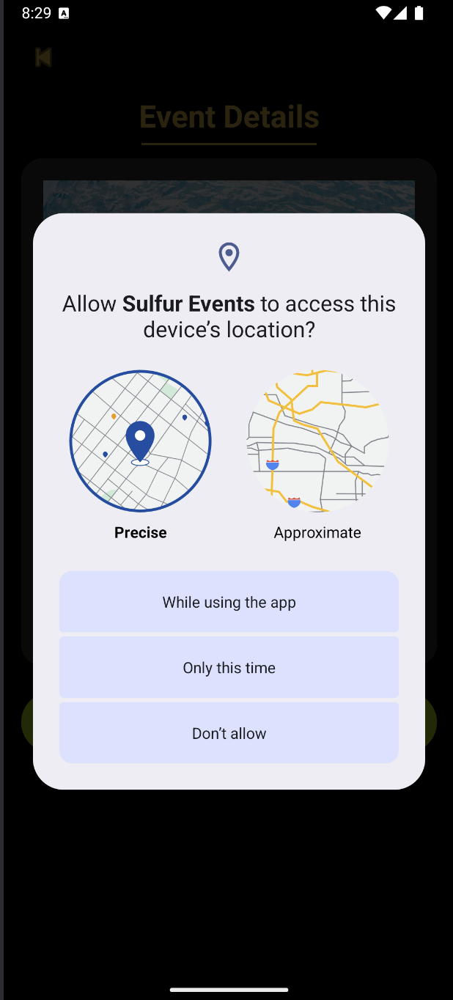 | **Geolocation Permission** — Prompt requesting access to device location. |
| 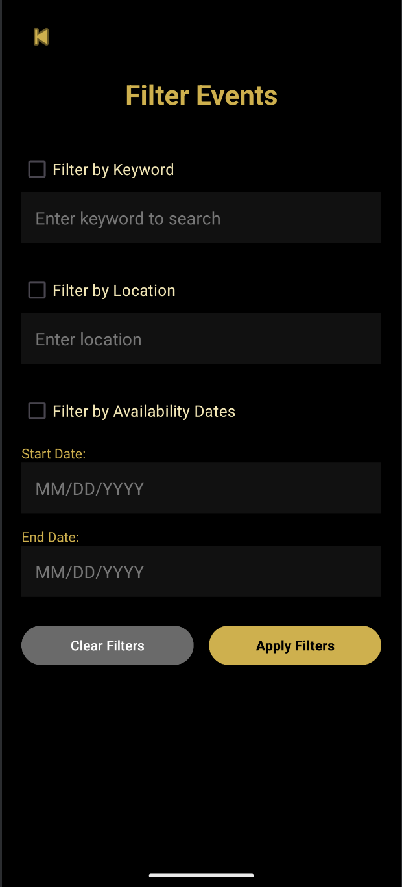 | **Filter Events** — Entrants filtering events by keyword, date, and location. |
| 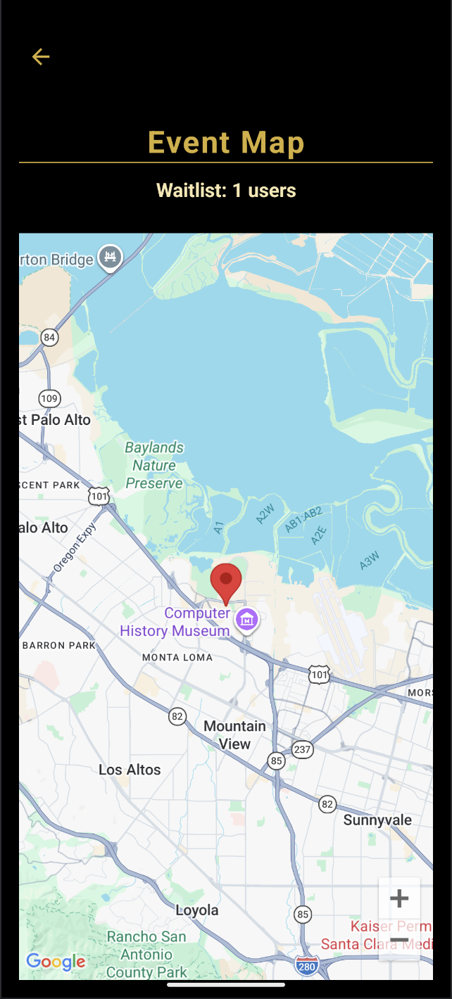 | **Geolocation Map** — Organizer map showing entrant distribution. |
|  | **Joinable Events** — List of events entrants may sign up for. |
| 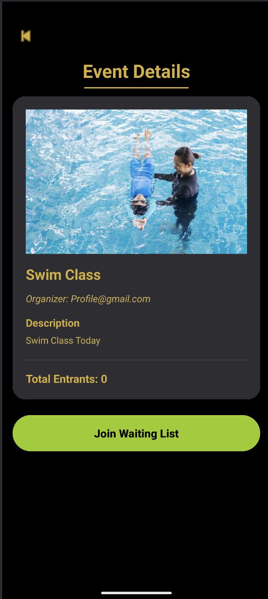 | **Event Details** — Entrant viewing event information and joining. |
| 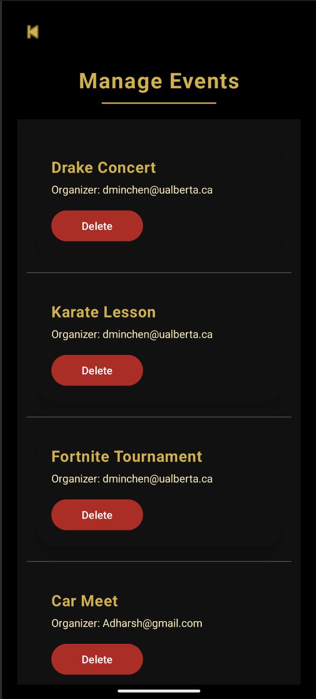 | **Manage Events** — Admin browsing and removing events. |
| 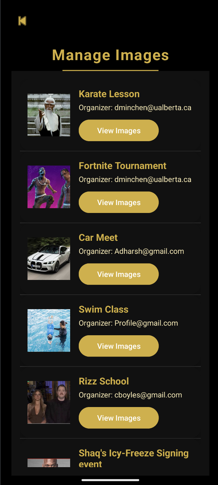 | **Manage Images** — Admin viewing and deleting uploaded posters. |
|  | **Manage Profiles** — Admin inspecting and removing user profiles. |
| 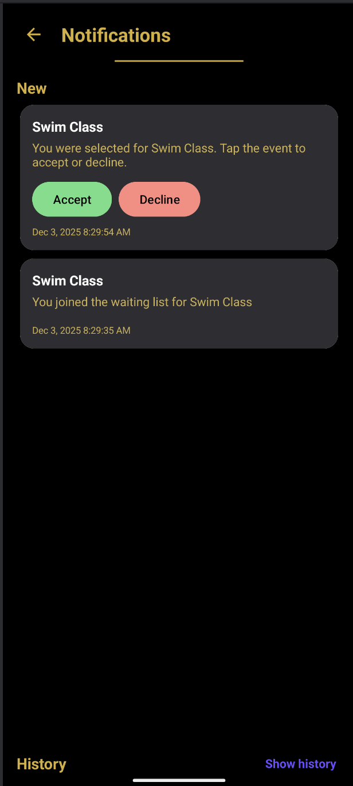 | **Notifications** — Entrant receiving lottery and waitlist updates. |
| 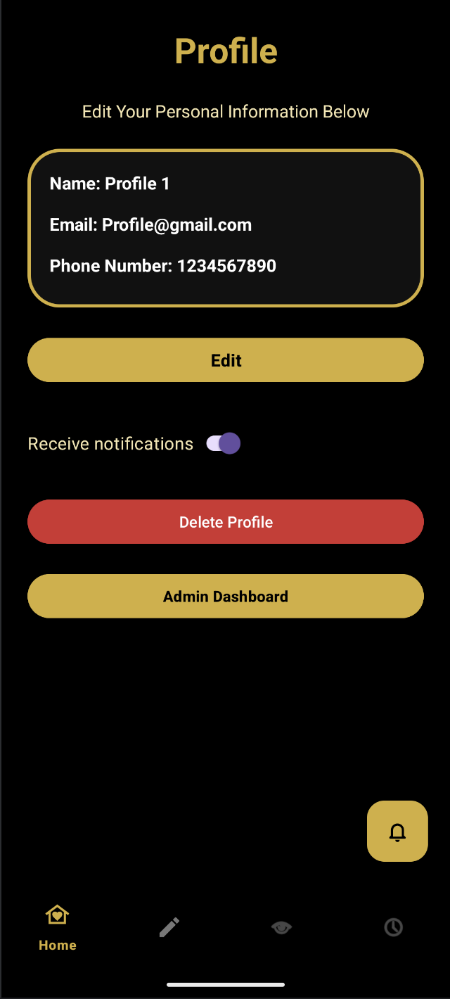 | **Profile Page** — Entrant editing their personal profile. |
| 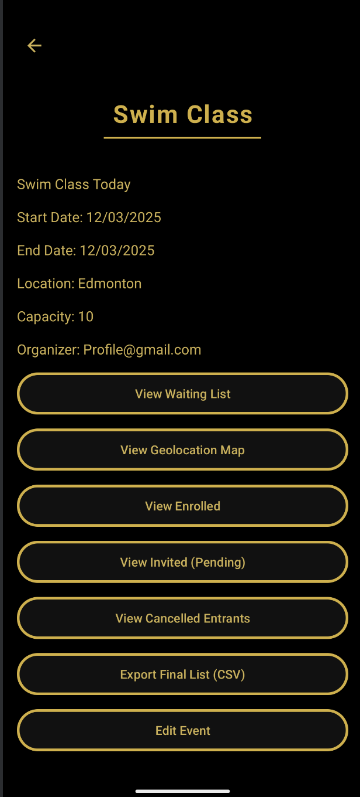 | **Organizer Event Panel** — View and manage all lists related to an event. |
| 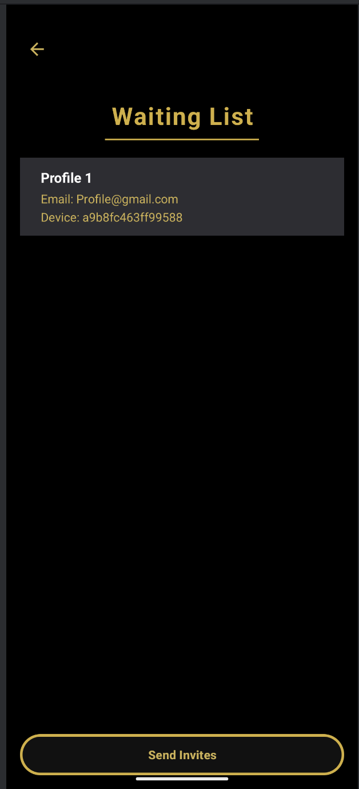 | **Waiting List** — Organizer reviewing pending entrants. |
| 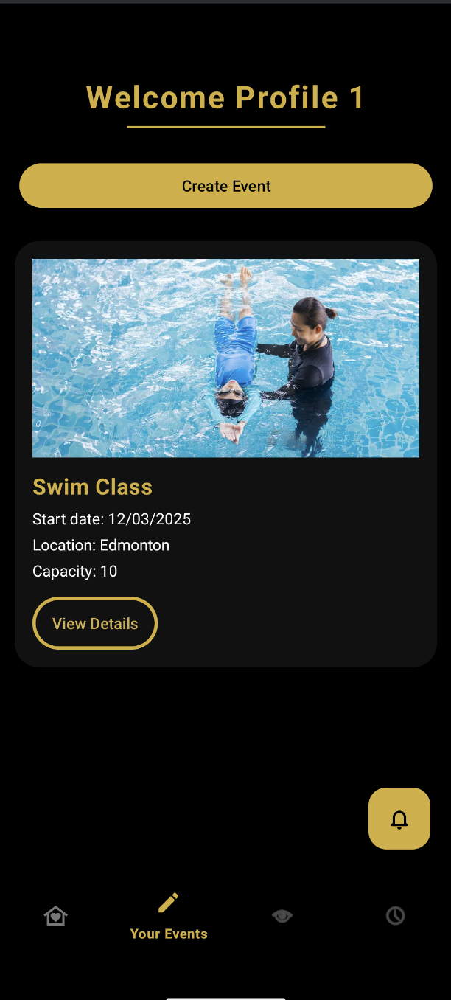 | **Your Events** — Organizer homepage displaying created events. |


##  Setup & Installation

To run this project locally, follow these steps:

1.  **Clone the Repository**

    ```bash
    git clone https://github.com/your-username/sulfur-events.git
    ```

2.  **Open in Android Studio**

    * Open Android Studio and select **Open an existing project**.
    * Navigate to the `sulfur-events` folder.

3.  **Firebase Configuration**

    * Ensure the `google-services.json` file is present in the `app/` directory.
    * *Note: If this file is missing, the app will not compile or connect to the database.*

4.  **Google Maps API**

    * The `AndroidManifest.xml` requires a valid Google Maps API key.
    * Ensure the key in `<meta-data android:name="com.google.android.geo.API_KEY" ... />` is active and has the correct SHA-1 fingerprint restrictions.

5.  **Build and Run**

    * Sync Gradle files.
    * Select a device/emulator (Recommended: Pixel 6 API 34+).
    * Click **Run**.

##  Testing

The project includes both Unit tests and UI tests.

* **Run Unit Tests:**
  Execute tests located in `src/test/java/` using JUnit.
* **Run UI Tests:**
  Execute tests located in `src/androidTest/java/` using Espresso.

##  License

This project is created for educational purposes within CMPUT 301 at the University of Alberta.

-----

